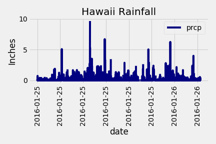

# SQLAlchemy Challenge
**Completed By:** Lauren Stein\
**Objective:** Create an API for querying Hawaii weather
---

## Part 1: Climate Analysis and Exploration
**Objective:** Conduct climate analysis on the 7 Hawaii weatherstations to assess annual rainfall and temperature
* 
# SQL Challenge
**Completed By:** Lauren Stein\
**Objective:** Utilize SQLAlchemy to conduct data analysis for Hawaii weather station recordings and generate an API to browse the data

---

## Part 1: Climate Analysis and Exploration
[Workflow](climate_starter.ipynb)
1. Create a [sqlite database](Resources/hawaii.sqlite) and SQLAlchemy to perform SQL queries and analyze with python
2. Retrieve last 12 months of preciptitation data - run summary statistics and plot the data
**Precipitation Analysis**

3. Create a histogram to assess temperature frequencies for the Hawaii station with the most recordings
**Temperature Analysis**

## Part 2: Create a Hawaii Climate API
[Workflow](app.py)
1. Homepage: available routes
2. **api/v1.0/preciptiation**: summary statistics for Hawaii precipitation
3. **api/v1.0//tobs**: Temperature for most active weather station
4. **api/v1.0/<start>**:Summary statistics for each weather station from starting date to last recording
5. **api/v1.0/<start>/<end>**: User defined date range for each weather station's summary statistics

